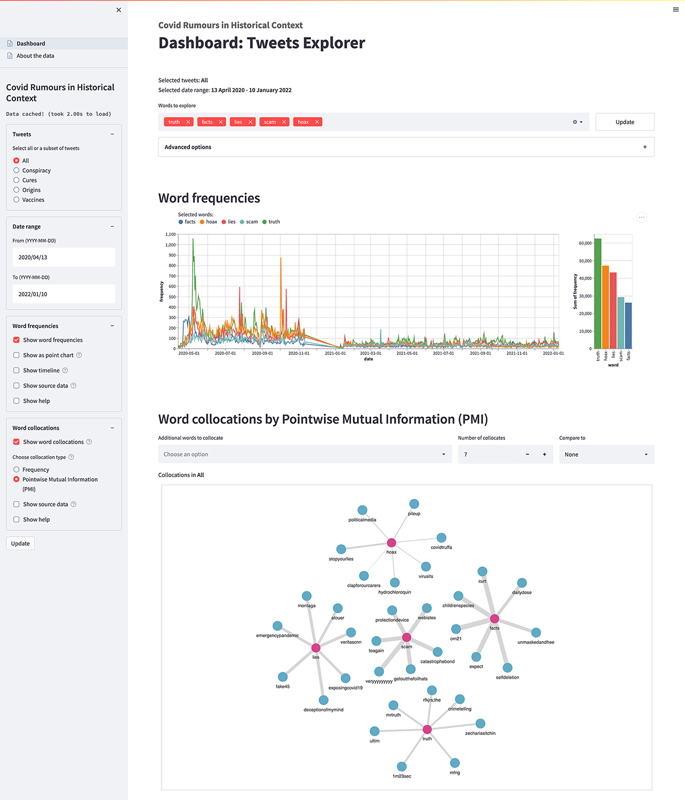
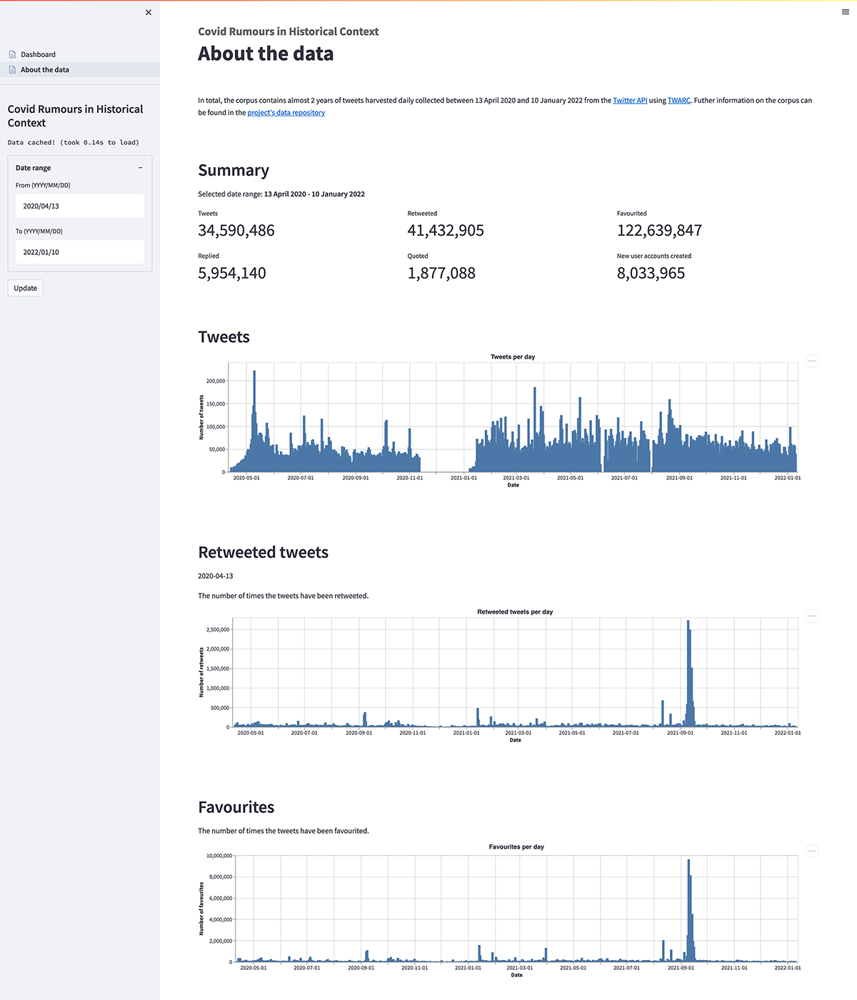

# Covid Rumours in Historical Context

[Covid Rumours in Historical Context](https://historyandrumour.blogs.sas.ac.uk), funded by UKRI's Arts and Humanities Research Council (AHRC Grant Ref: AH/V012762/1).

This project examined the pandemic of rumour and of disinformation that has accompanied the COVID-19 outbreak in the UK. It took a historical perspective, analysing how and why similar rumours have spread in the past, how previous governments have responded to them, and evaluating how successful these efforts were. The study tracked the language of rumours (via international English language Twitter data) relating to the COVID-19 pandemic and vaccination programme, and compared them to historical precedents.

**Project team**

Professor Jo Fox (PI, School of Advanced Study, University of London), Dr David Coast (Co-I, Bath Spa University), Professor James Smith (Co-I, Durham University), Martin Steer (Co-I, Digital Humanitites Research Hub, School of Advanced Study, University of London), Kunika Kono (Digital Humanitites Research Hub, School of Advanced Study), Jacob Forward (History & Policy, Insititute of Historical Research), Richard Williams (ITDS, University of London).

Thankyou to Sam Sakabuth (Wordpress setup and management) and Gemma Dormer (Events coordination and planning) for their help and support throughout the project.

**Publications**

Fox, Jo, David Coast, and Jacob Forward, "[Covid Rumours in Historical Context - Two Policymaking Paradigms](https://www.historyandpolicy.org/policy-papers/papers/covid-rumours-in-historical-context-two-policymaking-paradigms)", *History & Policy*, 2022

Forward, Jacob, Jo Fox, David Coast, James Smith, and Martin Steer, "[Data Workshop Report](https://historyandrumour.blogs.sas.ac.uk/data-workshop-report)", *History & Policy*, 2021

Fox, Jo, David Coast, James Smith, and Martin Steer, "[COVID-19 rumours in historical context](https://pandemicandbeyond.exeter.ac.uk/wp-content/uploads/2022/03/Rumours_Fox_PolicyBrief_Nov21.pdf)", *The Pandemic and Beyond*, 2021

<br />

## Project repositories

The project's digital outputs have been published in three repositories:
1. covid-rumours (to be released): Used for the data analysis, taxonomy and classifier modelling.
1. covid-rumours-data (to be released): Derivative data from the tweet corpus.
1. covid-rumours-dashboard (this repository): The dashboard for exploring diachronic semantic fields in the data.

For more information about each of these repositories, please see their respective README files.

This collection of 3 repositories link together the digital outputs of this project, including source code (working and not-working), raw data references, derivative and anonymous datasets, visualisation and data exploration dashboard, annotated tweet data, classifier pipelines, taxonomies of rumour and technical and methodological documentation.


<br />

## About the Dashboard

The Dashboard was built as a tool to process and explore the linguistic semantic fields within the corpus of Twitter data collected between April 2020 and January 2022. It implemented diachronic linguistic methods and allowed fine-grained conceptual associations used by the online communities to be better observed, contrasted and compared, and subsequently understood in the context of relevant historical precedents.

The Dashboard consists of 2 pages: Tweets Explorer and About the Data, which gives a statistical summary of the corpus.

[](https://github.com/SAS-DHRH/covid-rumours-dashboard/blob/master/assets/images/dashboard-tweets-explorer.png) [](https://github.com/SAS-DHRH/covid-rumours-dashboard/blob/master/assets/images/dashboard-about-the-data.png)

We chose [Streamlit](https://streamlit.io/) as our data dashboarding solution, for its simplicity and as it supported a range of widgets and visualisation libraries and allowed us to develop/revise and deploy in relatively quick cycles.

<br />

## Directory structure
The following is an outline of the directories and files in this repository and their descriptions.

```
│ # dashboard
├── Dashboard.py                <- Dashboard application.
├── pages                       <- Dashboard application subpages.
│   └── About_the_data.py
├── data                        <- Dashboard data.
│   ├── ALL                     <- Unigrams and bigrams across all topics.
│   ├── CONSIPRACY              <- Unigrams and bigrams per topic.
│   ├── CURES
│   ├── ORIGINS
│   ├── VACCINES
│   ├── stats                   <- Statistics of Twitter data collected.
│   ├── taxonomies              <- Taxonomies identified by the project.
│   └── timeline                <- Covid-19 events selected by the project.
├── assets
│   ├── css
│   │   └── dashboard.css       <- Dashboard stylesheet.
│   ├── images                  <- Images used in README.md.
│   └── pyvis_html              <- Word collocation network graphs are temporarily saved as HTML files in this directory.
│
│ # virtual environment configurations
├── .python-version
└── Pipfile
```

### Code

The Dashboard is a Python application, and the core files  `Dashboard.py` and `/pages/About_the_data.py` include notes and comments on processes, design considerations and constraints.

No error handling is included, and errors will be printed to the Dashboard screen.

### Data

#### Unigrams and bigrams
The unigrams and bigrams were generated from the corpus of Twitter data collected by the project for word frequency and collocation analyses and to gain insight into semantic connections between words used in tweets.

#### Taxonomies
Four taxonomies of rumour were produced from historical sources and close reading of a sample of the corpus, namely CONSPIRACY, CURES, ORIGINS and VACCINES. Each taxonomy includes a set of subcategories and vocabularies. The taxonomies were used to classify the English tweets for this project’s linguistic analyses and also in the Dashboard to explore the diachronic topical and categorical semantics.

#### Timeline
A selection of COVID-related events between April 2020 and July 2021 were chosen by the project, and used in the Dashboard to explore changes in the frequencies and spikes in word usage against a timeline of pandemic and to clarify the causal or acausal relationship between events in the physical and digital worlds.

#### Stats
General statistics of Twitter data collected originate from the [covid-rumours-data](https://github.com/SAS-DHRH/covid-rumours-data) repository and used in the Dashboard with no additional processing.


<br />

## Using the Dashboard

### Prerequisites

The Dashboard requires the following pre-installed on your computer:

| Requirement                              | Version used by the project |
| :---                                     |                        ---: |
| [Python 3](https://www.python.org/)      | 3.9.8                       |
| [Streamlit](https://streamlit.io/)       | 1.10.0                      |
| [Pandas](https://pandas.pydata.org/)     | 1.4.2                       |
| [Networkx](https://networkx.org/)        | 2.8.3                       |
| [Altair](https://altair-viz.github.io/)  | 4.2.0                       |
| [Pyvis](https://pyvis.readthedocs.io)    | 0.2.1                       |
| [Matplotlib](https://matplotlib.org/)    | 3.5.2                       |
| [Pyyaml](https://pyyaml.org/wiki/PyYAML) | 6.0                         |

Additionally, [Watchdog](https://pypi.org/project/watchdog/) is recommended by Streamlit for improved performance.

### Installation

[Download the Dashboard code](https://github.com/SAS-DHRH/covid-rumours-dashboard/archive/refs/heads/master.zip) and unzip it on your computer.

Or if you have Git installed on your computer, you can alternatively clone the code with the command:
```shell
$ git clone git@github.com:SAS-DHRH/covid-rumours-dashboard.git
```

### Usage

1. Navigate to the Dashboard code folder.
    ```shell
    $ cd /path/to/covid-rumours-dashboard
    ```

1. To start running the Dashboard, use the command:
   ```shell
   $ streamlit run Dashboard.py
   ```
   A new web browser window should open with the Dashboard loading. Alternatively, the Dashboard can be accessed by manually entering the URL `http://localhost:8501` into a web browser's address bar.

1. To stop the Dashboard, type the keyboard shortcut **Ctrl+c** (i.e. hold down the Ctrl key and press the c key) in your terminal window.


<br />

## Reproduction steps

The following describes the steps to reproduce the way in which we set up and run the Dashboard. We used MacBook Pro (Big Sur, Monterey), and Raspberry Pi 4 running Pi OS (Buster, Bullseye) and Ubuntu (20.04 LTS).

To maintain consistent development environment across different computers, we used [Pyenv](https://github.com/pyenv/pyenv) to manage Python version, and [Pipenv](https://pipenv.pypa.io/en/latest/) to create a virtual enviroment provisioned with specific versions of Python dependencies. This repository includes `.python-version` and `Pipfile` files which can be used to reproduce the virtual enviroment we used in this project.

1. Install [Pyenv](https://github.com/pyenv/pyenv), following [the installation instructions](https://github.com/pyenv/pyenv#installation) as appropriate, and [set up shell environment for Pyenv](https://github.com/pyenv/pyenv#set-up-your-shell-environment-for-pyenv).

1. Install Python version 3.9.8.

   ```shell
   $ pyenv install 3.9.8
   ```

1. Clone the `covid-rumours-dashboard` code.

   ```shell
   $ git clone git@github.com:SAS-DHRH/covid-rumours-dashboard.git
   ```

1. Change directory to the Dashboard code folder. This is the directory in which all the commands in the rest of the steps will be executed.

    ```shell
    $ cd /path/to/covid-rumours-dashboard
    ```

1. Check the Python version set for use by the Dashboard.

    ```shell
    $ pyenv version
    ```
    This repository includes a file named `.python-version` containing just one line `3.9.8` (the version of Python to use), and Pyenv should find and read the file and print an output in your terminal window like the following, with the `/path/to` part replaced by the actual path on your computer:

    ```shell
    3.9.8 (set by /path/to/covid-rumours-dashboard/.python-version)
    ```

    If a different version is printed in your terminal window (such as 'system' or another version number), try setting the version manually:

    ```shell
    $ pyenv local 3.9.8
    ```

1. Install Pipenv.

    ```shell
    $ pip install pipenv
    ```

1. Create a virtual environment with the required Python packages installed.

    ```shell
    $ pipenv install
    ```

    The `covid-rumours-dashboard` repository includes a file named `Pipfile`, and Pipenv should find and read the file, and install specific versions of required Python dependencies.

    To install all the required *and* recommended dependencies (i.e. including Watchdog), use the `--dev` flag:
    ```shell
    $ pipenv install --dev
    ```

1. Activate and enter the virtual environment.

    ```shell
    $ pipenv shell
    ```

1. Start the Dashboard.

    ```shell
    (covid-rumours-dashboard) $ streamlit run Dashboard.py
    ```
    You should see an output like this:
    ```shell
    You can now view your Streamlit app in your browser.

    Local URL: http://localhost:8501
    Network URL: http://192.168.1.80:8501
    ```
    A new web browser window should open with the Dashboard loading. Alternatively, the Dashboard can be accessed by manually entering the URL `http://localhost:8501` into a web browser's address bar.
    
    Leave the terminal window open while the Dashboard is running.

1. To stop the Dashboard, type the keyboard shortcut **Ctrl+c** (i.e. hold down the Ctrl key and press the c key) in your terminal window.

1. To exit the virtual environment, type `exit` in your terminal window and press the Return/Enter key.
   
1. To remove the virtual environment, run the command:

     ```shell
     $ pipenv --rm
     ```


<br />

## License

Unless otherwise stated, the data and code produced by the project are released under [Creative Commons CC0 1.0 Universal](https://creativecommons.org/publicdomain/zero/1.0/) license and in accordance with the [University of London’s research policies](https://www.sas.ac.uk/discover-our-research/research-governance-policies).

All Twitter data provided in the project's repositories is subject to Twitter's [Terms of Service](https://twitter.com/en/tos), [Privacy Policy](https://twitter.com/en/privacy), [Developer Agreement](https://developer.twitter.com/en/developer-terms/agreement), and [Developer Policy](https://developer.twitter.com/en/developer-terms/policy). Tweet IDs, where included, are shared for the sole purpose of non-commercial research, as stipulated by Twitter's [terms of content redistribution](https://developer.twitter.com/en/developer-terms/policy).


<br />

## Disclaimer

All the data and code in this project's repositories are provided as-is.


<br />

\---

Martin Steer and Kunika Kono, [Digital Humanities Research Hub (DHRH)](https://www.sas.ac.uk/digital-humanities), School of Advanced Study (SAS), University of London.  

:octocat: Find us on GitHub at https://github.com/SAS-DHRH
